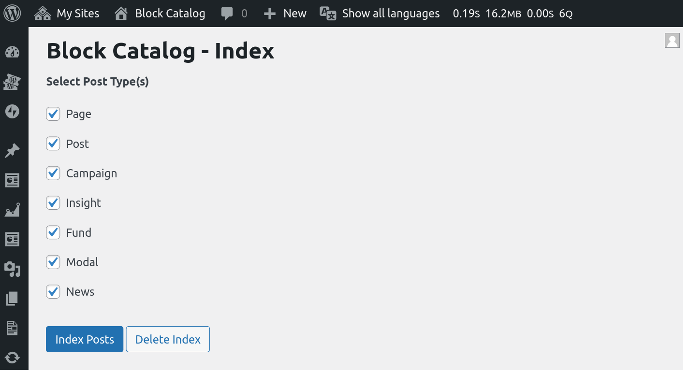
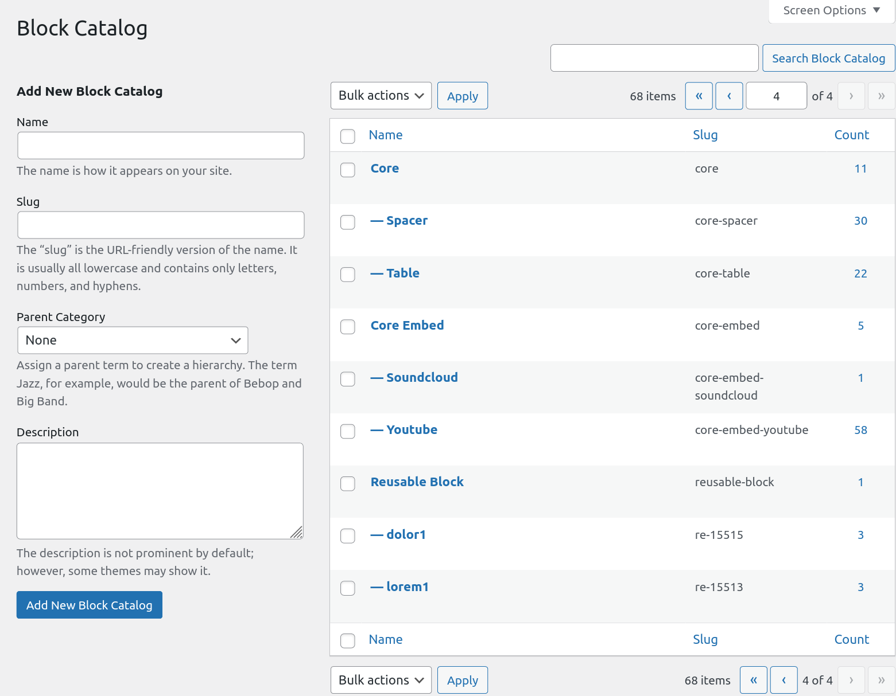
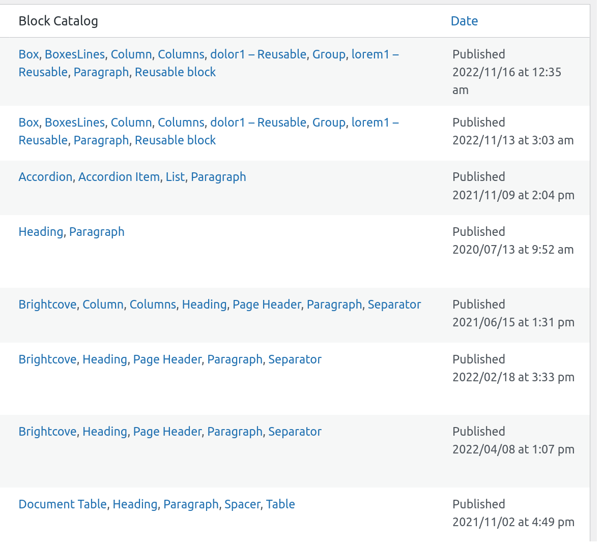
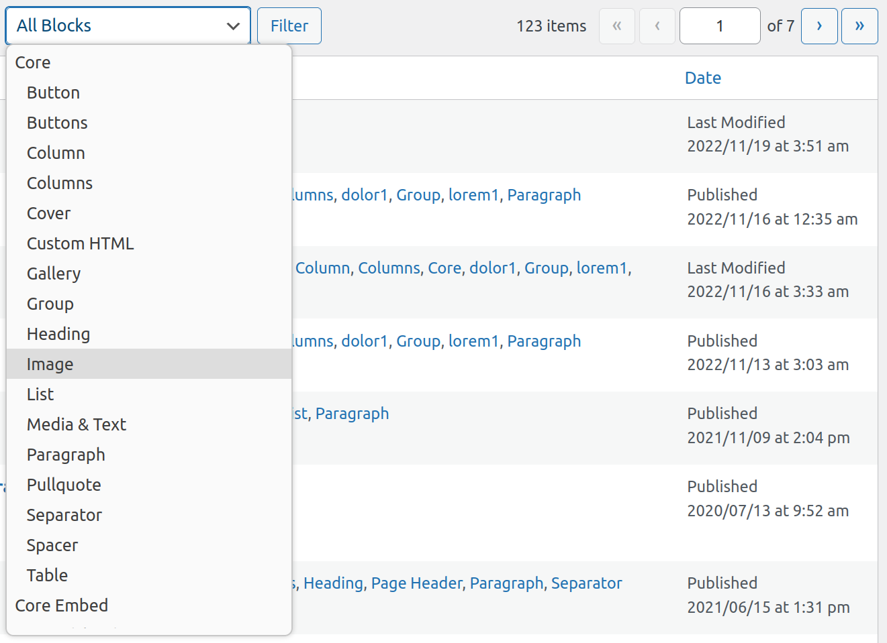

# Block Catalog
> Easily keep track of which Gutenberg Blocks are used across your site.


[](https://github.com/10up/block-catalog/blob/develop/LICENSE.md)

## Table of Contents
* [Features](#features)
* [Requirements](#requirements)
* [Installation via GitHub](#installation-via-github)
* [WP CLI Commands](#wp-cli-commands)
* [FAQs](#frequently-asked-questions)
* [Support](#support-level)
* [Changelog](#changelog)
* [Contributing](#contributing)

## Features

* Find which blocks are used across your site.
* Fully Integrated with the WordPress Admin.
* Use filters to see Posts that use a specific block.
* Find Posts that use Reusable Blocks.
* Use the WP CLI to quickly find blocks from the command line.
* Use custom WordPress filters to extend the Block Catalog.

## Requirements

* PHP 7.4+
* [WordPress](http://wordpress.org) 5.7+


## Installation via GitHub

#### 1. Download or Clone this repo, install dependencies and build.

- `git clone https://github.com/10up/block-catalog.git && cd block-catalog`
- `composer install && npm install && npm run build`

#### 2. Activate Plugin

## Getting Started

On activation, the plugin will prompt you to index your content. You need to do this first before you will be able to see the various blocks used on your site. You can also go to *WP-Admin > Tools > Block Catalog* to do this yourself.



Alternately, you can run the WP CLI command `wp block-catalog index` to index your content from the command line.

Once indexed, you will be able to see the different blocks used on your site in the Block Catalog Taxonomy.



Navigating to an Block Editor post type will also show you the list of blocks present in a post.



You can also filter the listing to only show Posts that have a specific block.



## WP CLI Commands

The following WP CLI commands are supported by the Block Catalog plugin.

* `wp block-catalog index [--only=<only>] [--dry-run]`

	Iterates through all posts and catalogs them one at a time.

  * [--only=\<only\>]
    Limits the command to the specified comma delimited post ids

  * [--dry-run]
    Runs catalog without saving changes to the DB.

* `wp block-catalog find <blocks>... [--index] [--fields] [--format] [--post_type] [--posts_per_page] [--post_status] [--count=<count>] [--operator=<operator>]`
   Finds the list of posts having the specified block(s)
  * \<blocks\>...
    The block names to search for, eg:- core/embed

  * [--index]
    Whether to re-index before searching.

  * [--fields=\<fields\>]
    List of post fields to display.

  * [--format=\<format\>]
    Output format, default table.

  * [--post_type=\<post_type\>]
    Limit search to specified post types.

  * [--posts_per_page=\<posts_per_page\>]
    Number of posts to find per page, default 20

  * [--post_status=\<post_status\>]
    Post status of posts to search, default 'publish'

  * [--count=\<count\>]
    Prints total found posts, default true

  * [--operator=\<operator\>]
    The query operator to be used in the search clause. Default IN.

* `wp block-catalog delete-index`
   Resets the Block Catalog by removing all catalog terms.
* `wp block-catalog post-blocks <post-id> [--index]`
   Prints the list of blocks in the specified post.
  * \<post-id\>
    The post id to lookup blocks for.

  * [--index]
    Where to re-index the post before printing.


## Frequently Asked Questions

### 1) Why does the Plugin require indexing?

Block Catalog uses a taxonomy to store the data about blocks used across a site. The plugin can build this index via the Tools > Block Catalog screen or via the WP CLI `wp block-catalog index`. After the initial index, the data is automatically kept in sync after any content updates.

### 2) Why does the name displayed in the plugin use the blockName attribute instead of the title?

If your blocks are registered on the Backend with the old [register_block_type](https://developer.wordpress.org/reference/functions/register_block_type/) API, you may be missing the `title` attribute. The newer [register_block_type_from_metadata](https://developer.wordpress.org/reference/functions/register_block_type_from_metadata/) uses the same `block.json` on the FE and BE which includes the Block title.

When the plugin detects such a missing `title`, it uses the `blockName` suffix instead. eg:- xyz/custom-block will display as Custom Block.

To address this you need to update your custom block registration. If this is outside your control, you can also use the `block_catalog_block_title` filter hook to override the title as seen below.

```<?php
add_filter( 'block_catalog_block_title', function( $title, $block_name, $block ) {
	$map = [
		"xyz/custom-block" => "My Custom Block",
	];

	if ( ! empty( $map[ $block_name ] ) ) {
		return $map[ $block_name ];
	}

	return $title;
}, 10, 3 );

```

## Support Level

**Active:** 10up is actively working on this, and we expect to continue work for the foreseeable future including keeping tested up to the most recent version of WordPress.  Bug reports, feature requests, questions, and pull requests are welcome.

## Changelog

A complete listing of all notable changes to Block Catalog are documented in [CHANGELOG.md](CHANGELOG.md).

## Contributing

Please read [CODE_OF_CONDUCT.md](CODE_OF_CONDUCT.md) for details on our code of conduct, [CONTRIBUTING.md](CONTRIBUTING.md) for details on the process for submitting pull requests to us, and [CREDITS.md](CREDITS.md) for a listing of maintainers, contributors, and libraries for Block Catalog.

## Like what you see?

<a href="http://10up.com/contact/"></a>
